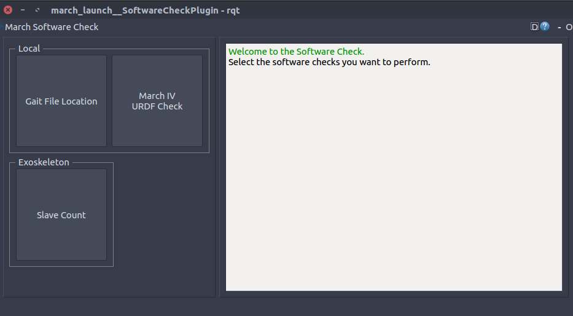
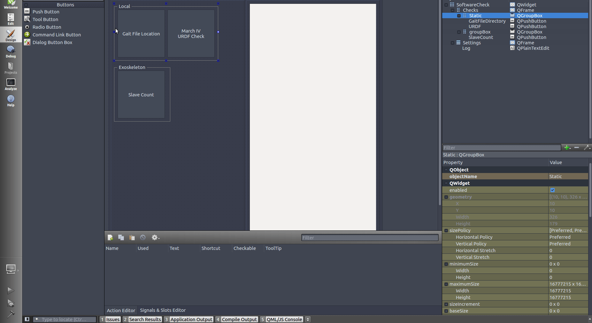

march_launch
============

Overview
--------
The march_launch package is a collection of launch files which are used to start the exoskeleton and validate its workings.

The exoskeleton is launched with

.. code::

  roslaunch march_launch march_iv.launch

For more information on how to launch the exoskeleton, see :ref:`how-to-airgait-label`.

It also contains a plugin called the ``march_rqt_software_check``.
This plugin allows users to easily perform software checks without worrying about the underlying code.

.. code::

  roslaunch march_launch march_rqt_software_check.launch

   The march_rqt_software_check window

Some checks will require manual confirmation if the result is not always interpretable (e.g. the amount of slaves found).

Checks will change color based on their result, giving a nice overview of which checks have already been run.

ROS API
-------
As this package contains an rqt plugin which can start arbitrary launch files,
it can spawn any amount of nodes, topics and parameters.

Nodes
^^^^^
*march_rqt_software_check* - The rqt plugin that allows you to start software checks.

Parameters
^^^^^^^^^^
If a specific script is written to calculate the result of a check,
it is convention to upload it to ``/check/<check_name>`` (e.g. ``/check/slave_count``)

Tutorials
---------

Adding a software check
^^^^^^^^^^^^^^^^^^^^^^^
When adding a software check for the first time, make sure to take a look at existing software checks. The ``SlaveCountCheck`` especially is suitable as it runs on another machine. The following steps will guide you through the process.

Add it to the UI
~~~~~~~~~~~~~~~~
- Open :march-iv:`software_check.ui <march_launch/resource/software_check.ui>` in Qt designer/creator.
- Add another button following the steps below:

- Give the button a clear and concise name.

Creating your software check
~~~~~~~~~~~~~~~~~~~~~~~~~~~~

- Create a new class that extends from the type of check you want to create.
- Make sure to closely inspect the :march-iv:`SoftwareCheck<march_launch/src/march_launch/checks/SoftwareCheck.py>` base class and the :march-iv:`LaunchCheck <march_launch/src/march_launch/checks/SoftwareCheck.py>` derived class to see the available methods.
- Make sure your check calls ``self.launch()`` if it extends the ``LaunchCheck``
- Perform your check.
- Set ``self.done`` and ``self.passed`` accordingly during your check.
- Make sure the launch process is stopped if it was started ``self.stop_launch_process()``.

Add it to the CheckRunner
~~~~~~~~~~~~~~~~~~~~~~~~~
- Add an instance of your check to :march-iv:`CheckRunner.checks <march_launch/src/march_launch/CheckRunner.py>`.
- Connect your check with the UI button in :march-iv:`software_check.__init__() <march_launch/src/march_launch/software_check.py>`.

Creating the executable (optional)
~~~~~~~~~~~~~~~~~~~~~~~~~~~~~~~~~~
If your check relies on a calculation from another package, you should create an executable in th package where the check is running.
An example can be seen with the executable ``slave_count_check`` created in :hardware-interface:`SlaveCount.cpp <march_hardware/check/SlaveCount.cpp>`
and :hardware-interface:`CMakeLists.txt <march_hardware/CMakeLists.txt>`.

Notice how the result is uploaded to ``/check/slave_count``.

When running an executable from another package, it is often preferable to create a launch file in the march_launch package that starts that executable, possibly even on the exoskeleton instead of locally.
An example can be found in :march-iv:`slave_count.launch <march_launch/launch/checks/slave_count.launch>`.

FAQ
---

How do I see which checks exist?
^^^^^^^^^^^^^^^^^^^^^^^^^^^^^^^^
The easiest way is to launch the software check plugin and look at which buttons are available:

.. code::

  roslaunch march_launch march_rqt_software_check

Or take a look at the :march-iv:`CheckRunner source code<march_launch/src/march_launch/CheckRunner.py>`.
