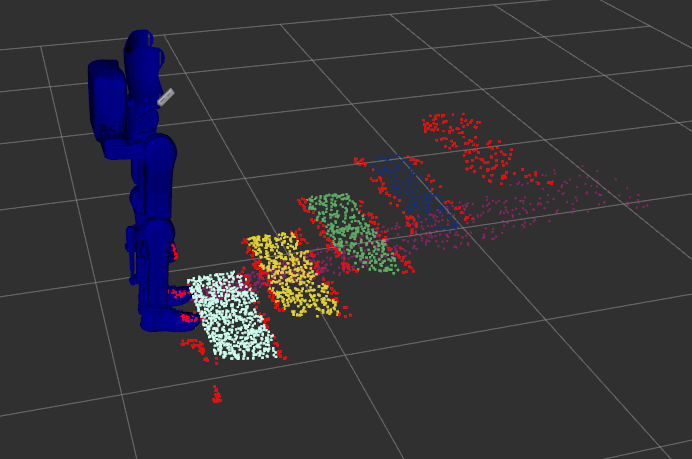
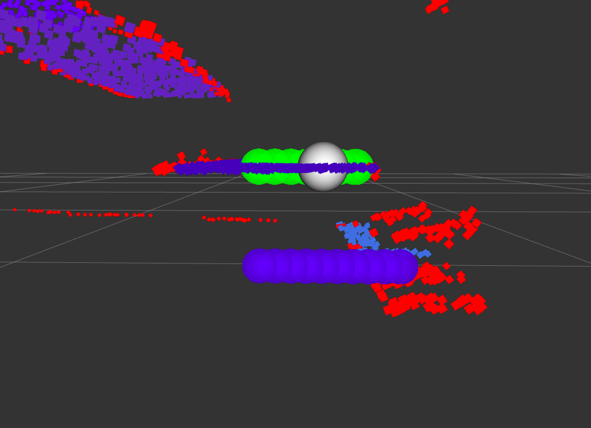
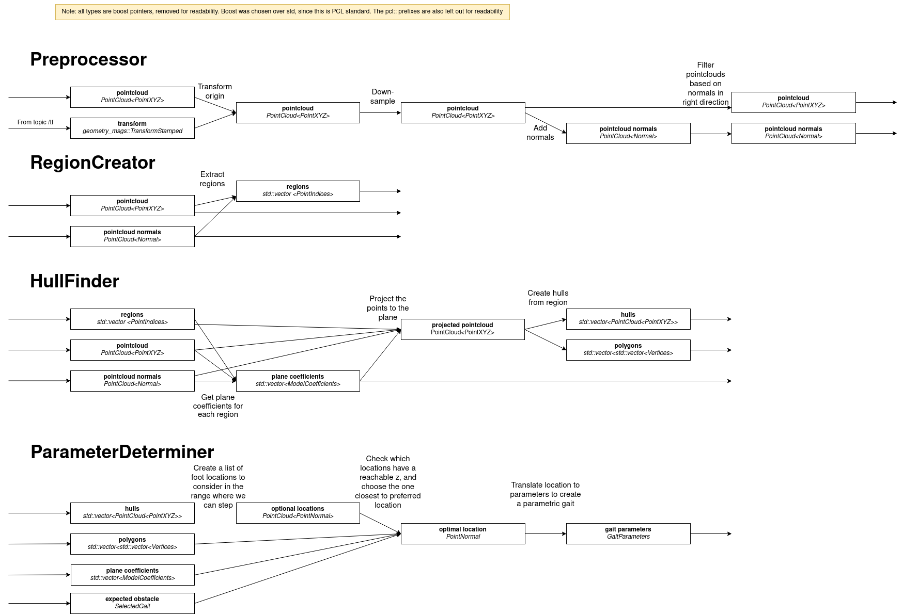
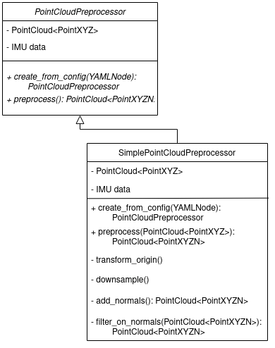
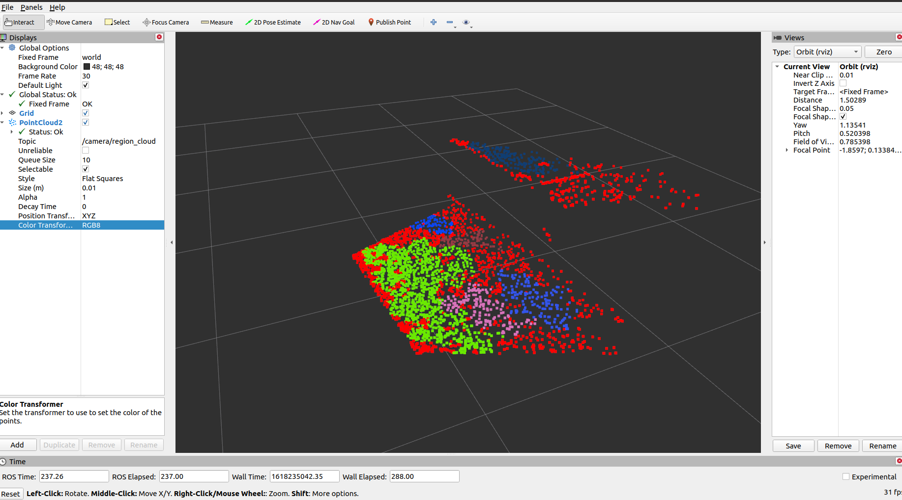

.. _march-realsense_reader-label:

march_realsense_reader
======================

Overview
--------
The MARCH realsense reader package's goal is to obtain the dimensions of obstacles in a unknown environment. The MARCH VI
uses two `d435i <https://www.intelrealsense.com/depth-camera-d435i/>`_ camera's for this purpose. This package
subscribes the the realsense camera topics and processes one of pointclouds published there with a service callback.

The processing makes heavy use of the `Point Cloud Library (PCL) <https://pointclouds.org/>`_ to do the processing.
Many of its classes are used even when not directly using methods from PCL.

The processing consists does 4 main phases:

* Preprocess the point cloud

* Find regions in the preprocessed cloud

* Create hulls from the found regions

* Find parameters with which gaits can be interpolated

The package publishes the results of all the steps for visualization in RVIZ, if the debug parameter is set to true.

These steps are embodied by the interfaces ``Preprocessor``, ``RegionCreator``, ``HullFinder`` and ``ParameterDeterminer``.
These have implementations which execute the logic, these classes can do this in different ways.
We currently use the implementations ``NormalsPreprocessor``, ``RegionGrower``, ``CHullFinder`` and ``HullParameterDeterminer``.

NormalsPreprocessor
^^^^^^^^^^^^^^^^^^^

The idea behind this step is that a point cloud can be noisy, large, and filled with points which are not necessarily relevant.
Preprocessing aims to reduce the point cloud size and the useless areas.
We currently do not remove statistical outliers as this proved too computationally expensive where preprocessing aims to increase time efficiency.

Preprocessing consists of the following steps:

  1. Randomly remove points from the point cloud.
     This is done because the pointcloud consist of almost 1 million points and we need to speed up the computation.
     Reducing the size by leaving point in a grid of a certain size is possible too, but that is more computationally expensive.

  2. Transform the point cloud such that its origin is at the foot that is about to take a step and its orientation matches the orientation of this foot too. The link that will be taking the step is given by the service caller (the RealSenseGait).

  3. Filter points which are too far away from the origin, as points far away are not relevant to the upcoming steps of the exoskeleton.

  4. Estimate the normal vectors of the remaining point cloud.

  5. Filter based on the normal vectors, we remove points which do not have a normal in an upwards direction (e.g. points on a wall) as we are not capable of standing there.

.. figure:: images/NormalsPreprocessor.png
   :align: center

RegionGrower
^^^^^^^^^^^^

The idea behind finding regions is that in the preprocessed cloud there are certain areas which belong together.
Regions where it is possible to place the foot, like a step of a stair. Region finding finds these regions which belong together.

We use the region growing algorithm to find regions in the cloud which is explained in detail in
`The pcl tutorial on region growing segmentation <https://pcl.readthedocs.io/projects/tutorials/en/latest/region_growing_segmentation.html>`_

CHullFinder
^^^^^^^^^^^

In order to find a potential foot location in the point cloud we want to be able test if we can place our foot at some location.
In other words, we need a way to verify if a point in inside a region or not. To this end we need to make an outline or hull of the regions.

To make these hulls we need to do the following for each region we received from the region creator:

  1. Find a plane which fits the region. This is needed because the regions we consider are areas and not volumes so we
     make use of 2 dimensional hulls. This is why we also need to make the regions 2D which we do by projecting the region to a fitting plane.

  2. Project all the points in the region to the plane

  3. Transform the projected points into a hull. This hull can either be made convex or concave hull, hence the name CHullFinder.
     PCL handles this for us.

  4. Add the found hull, the parameters of the plane it is in and a vector of the indices to vectors for future use.

.. figure:: images/Planes.png
 :align: center

HullParameterDeterminer
^^^^^^^^^^^^^^^^^^^^^^^

Now that we have hulls (or bounded planes) where where we can potentially place the foot. We can start finding a desired
foot location depending on the gait that is to be executed.

The specifics of this class differ per obstacle. Consider for example the stairs gait:
when finding a parameter for the stairs gait, the foot can be placed anywhere in a bounded 2D plane in space (anywhere between
low-undeep, low-deep, high-undeep, high-deep stair) and therefore also two parameters will need to be found, one specifying the
depth of the step, and one specifying the height of the step. This contrasts with the ramp gait for which is interpolated between
a steep and flat ramp and as a result the foot can be placed anywhere on some line between the final foot locations of the
flat and steep gait.

For the stairs method this is done as follows:

  1. The stairs gait is interpolated from a low deep, high deep, low undeep & high undeep gait.
     We can place the foot anywhere in the area between the end locations of those gaits.

  2. For a number of foot locations on the ground test whether there is a potential foot location at some height. This gives optional foot locations.
     This is done by, for each region:

       1. Elevating the points on the ground to the plane of the region

       2. Checking if the elevated points are inside or outside the hull

       3. The points inside the hull are optional foot locations

  3. For all the optional foot locations find which one is valid (reachable by the gaits) and closest to some
     ideal location (the lowest, smallest possible end location for example).

  4. Transform this into a parameter by finding at what percentage of the existing gaits end locations the foot location is located.

For the ramp gait this is done as follows:

  1. The ramp gait is interpolated from a flat & steep gait. We can place the foot anywhere in between the two ending locations of the gait.
     This is what we call the 'executable foot locations line'.

  2. For a number of foot locations on the ground test whether there is a potential foot location at some height. This gives optional foot locations.
     This is done in the same way as for the stairs gait.

  3. For all the optional foot locations find which one is valid and closest to the executable foot locations line.
     Checking if a gait is valid for the ramp gait is as follows:

       1. Project the location to the executable foot locations line

       2. Check if this projected location is in between the flat and steep gait end locations

       3. Check if the distance between the projected location and the original location is not too big.

  4. Transform this into a parameter by finding at what percentage of the executable foot locations line.

Software Architecture
^^^^^^^^^^^^^^^^^^^^^

The generalized steps we are expecting from the PCL implementation, split into classes where we expect to possibly implement multiple alternatives:

This will be implemented in the form of an Interface for every of these 4 steps, that can be inherited by any possible implementation of these steps.
The inbetween steps will then be split into functions within this class. See below for an example for the preprocessor step:

ROS API
-------

Nodes
^^^^^
*realsense_reader_node* - Responsible for obtaining the pointlcouds from the camera's and processing them.

Subscribed Topics
^^^^^^^^^^^^^^^^^

*"/camera_front/depth/color/points"* sensor_msgs::PointCloud2
  The realsense front camera publishes its pointcloud on this topic.

*"/camera_back/depth/color/points"* sensor_msgs::PointCloud2
  The realsense back camera publishes its pointcloud on this topic

Published Topics
^^^^^^^^^^^^^^^^
The package publisher several debug pointclouds and markers, if the debug flag is enabled. These topics are purely for visualisation:

*/camera/preprocessed_cloud* (sensor_msgs::PointCloud2)
  The pointcloud outputted by the `preprocessor`. This cloud contains only the points part of a locally roughly flat area, and has a lower
  point density than the original cloud and is transformed to the frame id specified by the /camera/process_pointcloud service.

*/camera/region_cloud* (pcl::PointCloud<pcl::PointXYZRGB>)
  This topic contains a single region cloud, created by the `region_creator`. The points in the cloud are grouped into
  a 'region', indicated by a colour for every region. Red points are not part of any region.

*/camera/hull_marker_list* (visualization_msgs::Marker)
  Markers that visualise the boundary of regions. This boundary is created using a convex or concave hull. This hull is
  used to determine the possible foot locations.

*/camera/foot_locations_marker_array* (visualization_msgs::MarkerArray)
  Markers that visualize the steps of the parameter determiner. The optional foot locations are in blue, the possible locations are in green
  and the optimal location is highlighted in white.

Services
^^^^^^^^
*/camera/process_pointcloud*
  Calls upon the `march_realsense_reader`. Outputs the `gait_parameters` from which a parametric gait can be constructed.
  requires the selected gait and the frame id to transform the point cloud to.

Tutorials
---------
These tutorials use the convenient aliases from :ref:`march_aliases-label`

Running the package in simulation
^^^^^^^^^^^^^^^^^^^^^^^^^^^^^^^^^
It is recommended to run all commands in separate terminals.

.. code :: bash

    march_run_ros1 gazebo_ui:=true obstacle:=stairs ground_gait:=true realsense:=true
    march_run_ros2 ground_gait:=true
    march_run_bridge

This will start both RViz and Gazebo. We use Gazebo to model the stairs, and RViz to visualise the pointlcouds. In RViz
add a `pointcloud2`, and set the topic to `/camera/preprocessed_cloud` or `/camera/region_cloud`. Calling the service

.. code :: bash

  snoe && sros1 && rosservice call /camera/process_pointcloud "selected_gait: 0 frame_id_to_transform_to: 'foot_right'"

will result in a pointlcoud in RViz with regions indicated by colour.

Running with one camera
^^^^^^^^^^^^^^^^^^^^^^^
You need a camera for this example. This tutorial shows you how to run the exoskeleton with a physical camera and visualize its results.

First start up the exoskeleton, it is recommended to run all commands in separate terminals.

.. code :: bash

    march_run_ros1 ground_gait:=true realsense:=true realsense_simulation:=false
    march_run_ros2 ground_gait:=true use_imu_data:=true
    march_run_bridge

This will start RViz. In RViz add a `pointcloud2` and set the topic to /camera_front/depth/color/points`, this will visualize what the camera is seeing.
Also add the robot model to see how the exoskeleton would fall in this world view, note how the camera dictates the orientation.
If you now hold the camera so that the exo is upright, set the point cloud topic to ` /camera/region_cloud` and call the processing service

.. code :: bash

  snoe && sros1 && rosservice call /camera/process_pointcloud "selected_gait: 0 frame_id_to_transform_to: 'foot_right'"

you will see the result of processing the cloud which, if the tuning of the algorithm is correct and the camera is in the right position,
should look something like:

Running with both cameras
^^^^^^^^^^^^^^^^^^^^^^^^^
You need two cameras for this example. This tutorial is very similar to the Running with one camera tutorial.
The main difference is in starting up the exoskeleton. If you have the cameras with the 'front' and 'back' labels, this
can be done by running in separate terminals the following:

 .. code :: bash

     march_run_ros1 ground_gait:=true realsense:=true realsense_simulation:=false use_camera_back:=true
     march_run_ros2 ground_gait:=true use_imu_data:=true
     march_run_bridge

If not run:

.. code :: bash

    march_run_ros1 ground_gait:=true realsense:=true realsense_simulation:=false serial_no_camera_front:=<your-front-serial-number> use_camera_back:=true serial_no_camera_back:=<your-back-serial-number>
    march_run_ros2 ground_gait:=true use_imu_data:=true
    march_run_bridge

The processor only uses the front camera for now, but one can now also visualize the back camera in RViz.

Configuring the realsense_reader
^^^^^^^^^^^^^^^^^^^^^^^^^^^^^^^^
The processor has a default configuration. This configuration affects what points are discarded in the preprocessor,
which regions are found and what the potential foot locations are. The march_realsense_reader support dynamic reconfiguration.
The rqt interface can be launched by:

.. code :: bash

    snoe && sros1 && rosrun rqt_reconfigure rqt_reconfigure

while running for example the simulation. Changing the parameters and calling upon */camera/process_pointcloud*, will
result in different outputs.

