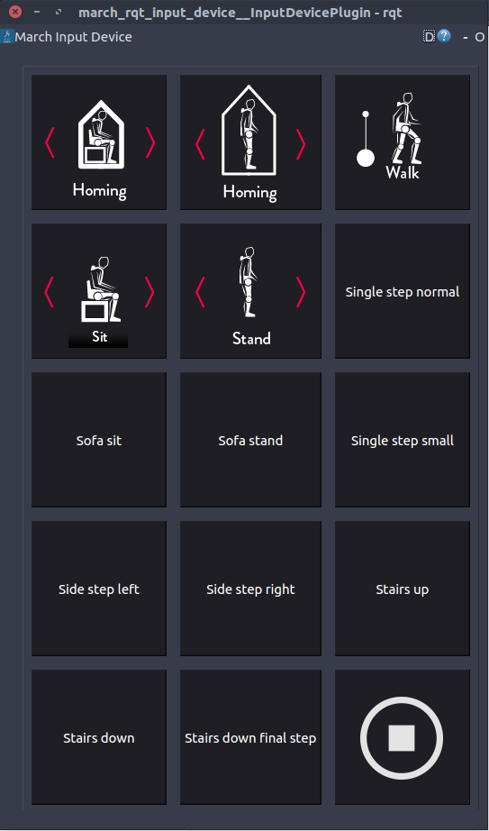

march_rqt_input_device
======================

Overview
--------
The march_rqt_input_device is an rqt plugin that features as a mock input device during training and development.
It allows you to easily send gait instructions and stop commands, as well as fake errors.

The march_rqt_input_device was designed to easily allow you to add custom buttons.

Launching
^^^^^^^^^
The *march_rqt_input_device* can be started just as every other package:

.. code::

    roslaunch march_rqt_input_device march_rqt_input_device.launch

In case you don't want to ping the *safety node* with an alive message you can set the launch parameter **ping_safety_node**.
This can be useful when you are using the normal input device and the *march_rqt_input_device* the same time and losing the
normal input device should cause the *safety node* to throw an error.

.. code::

    roslaunch march_rqt_input_device march_rqt_input_device.launch ping_safety_node:=false

ROS API
-------

Nodes
^^^^^

*march_rqt_input_device* - The rqt plugin that can send gait instructions and errors.

Published Topics
^^^^^^^^^^^^^^^^

.. todo:: (Tim) Add link to march_safety when it's done.

*/march/input_device/alive* (`std_msgs/Empty <http://docs.ros.org/kinetic/api/std_msgs/html/msg/Empty.html>`_)
  Publish empty alive messages so the Safety node doesn't throw a warning.

*/march/input_device/instruction* (:march-iv:`march_shared_resources/GaitInstruction <march_shared_resources/msg/GaitInstruction.msg>`)
  Send instructions to the state machine.

*/march/error* (:march-iv:`march_shared_resources/Error <march_shared_resources/msg/Error.msg>`)
  Throw a fake error for the state machine to react to.

Tutorials
---------

.. _add-a-new-button-label:

Add a new button
^^^^^^^^^^^^^^^^
In this tutorial we will add a new button which will have a custom callback that publishes on a new topic
Our button will publish a boolean message if this tutorial works on the topic ``/march/this/tutorial/works``

We only need to add code to :march-iv:`input_device.py <march_rqt_input_device/src/march_rqt_input_device/input_device.py>`.
Make sure to check this file before you start as it contains many examples of existing buttons.

.. hint::
  If the publisher your button needs already exists, you can skip some of the following steps.

Create a new publisher
~~~~~~~~~~~~~~~~~~~~~~
Create a new publisher in the ``__init__``:

.. code::

  from std_msgs.msg import Bool # Import the Bool msg if needed.

  self.this_tutorial_works_pub = rospy.Publisher('/march/this/tutorial/works', Bool, queue_size=10)

Create a publish function
~~~~~~~~~~~~~~~~~~~~~~~~~
.. code::

  def publish_this_tutorial_works(self):
        self.this_tutorial_works_pub.publish(Bool(True))

Create a button object
~~~~~~~~~~~~~~~~~~~~~~
.. code::

  this_tutorial_works_button = MarchButton(name="Publish True", callback=lambda: publish_this_tutorial_works())

Add it to the march_button_layout
~~~~~~~~~~~~~~~~~~~~~~~~~~~~~~~~~

A 2D array called ``march_button_layout`` defines the layout you will see on screen.
Make sure to add your button and pad it out with ``None`` so its dimensions remain consistent. Example:

.. code::

  march_button_layout = [
    [home_sit_button, home_stand_button, gait_walk_button],
    [this_tutorial_works_button, None, None]
  ]
