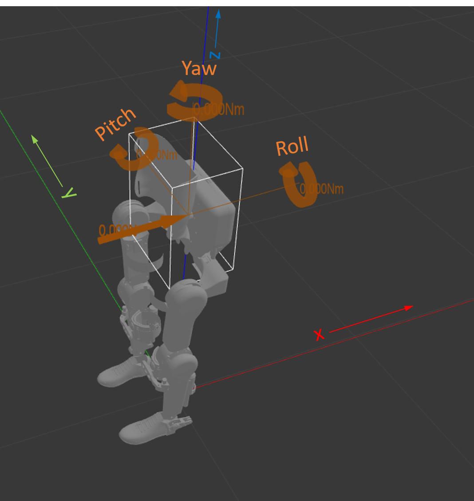

.. _march-simulation-label:

march_simulation
================

Overview
--------
The march simulation package launches `Gazebo <http://gazebosim.org/>`_ and spawns the :ref:`URDF <robot-model-label>` of the |march|.
Its goal is to provide an interface for our high-level code to call similar to that of the :ref:`march-hardware-interface-label`.

Usage
-----

The simulation can be launched using

.. code::

  roslaunch march_launch march_simulation.launch

This will launch the simulation using the rviz GUI. The backpack is fixed in space so the exoskeleton will move
similarly to airgaiting. It is also possible to groundgait in the simulation. We will need the Gazebo GUI for that,
so that the exoskeleton can move relative to the world. The launch command becomes

.. code::

  roslaunch march_launch march_simulation.launch rviz:=false gazebo_ui:=true ground_gait:=true

One can add an obstacle in simulation by adding the "obstacle:=<<obstacle_name>>" to the command. The possible
obstacles can be found in the obstacles folder of the march_simulation package. The current obstacles were created
after four of the `obstacles <https://ethz.ch/content/dam/ethz/special-interest/conference-websites-dam/cybathlon-dam/documents/CYBATHLON_Races_and_Rules.pdf/>`_
in the Cybathlon 2020. Creating a new xacro file in the obstacles folder is all that is needed to create a new obstacle
for the simulation.

Code structure
--------------

There are two important packages in the simulation repository.

march_simulation contains all basic functionality: launch file, world description, controller configuration
(config folder). It also contains URDFs of the obstacles.

march_gazebo_plugins contains the CoM controller gazebo plugin that allows the exoskeleton to groundgait without
falling in simulation.

CoM controller plugin
---------------------

Just like the real exoskeleton, the exoskeleton in simulation cannot stably walk without help. For this purpose the
CoM controller plugin was created. It seeks to mock not the pilot, but the coach during a ground gait session. This
for the simple reason that the behavior of the pilot is more erratic and therefore much harder to accurately simulate.

The controller consists of two parts: a target function that describes a desired x and y coordinate for the CoM, and a
PID controller that manipulates the CoM by applying *torque* to each of the parts. More details below.

Note the following:
1. The plugin assumes the subgait names start with left/right and end with open/swing/close. It will do nothing for
other subgaits.
2. The plugin might have to be re-tuned for an obstacle.

Target function
^^^^^^^^^^^^^^^

The target function for the CoM can depend on the obstacle. Furthermore, it needs to know which leg is stable (i.e. not
in swing), so it listens to the gait scheduler topic.

Walk target function
~~~~~~~~~~~~~~~~~~~~

The target function for walk moves in the x-direction (movement direction of exo) with speed step_size / step_duration.
The y-direction target is constantly the stable leg during a swing. It therefore switches discontinuously from one leg
to the other at the end of each swing.

Torque application
^^^^^^^^^^^^^^^^^^

The plugin ensures that the CoM does not stray far from the target through a PID controller. The controller applies a
compensating *torque* to each of the links (parts) in the exoskeleton. See image below for the definition of the axes
of rotation. Note that these axes are relative to the world, and do not change if the exoskeleton rotates. Hence, the
exoskeleton will always walk in a fixed direction (along the negative x-axis).

   The definition of the axes of rotation in the simulation. The axes are relative to the world.

Pitch and yaw torque is applied to each of the links. Roll toque is only applied to the 4 links in the stable leg.
This is necessary because roll torque will force the LHAA's apart when applied to both legs.

