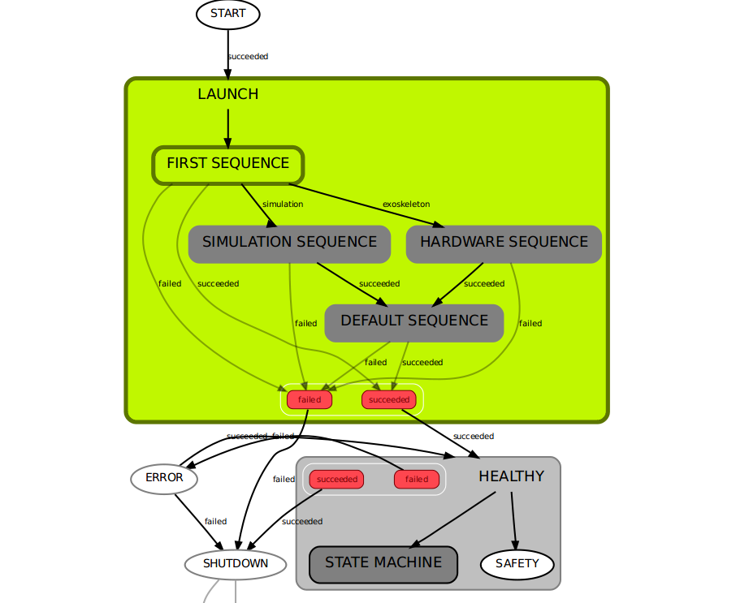

.. _march-state-machine-label:

march_state_machine
===================

Overview
--------
The march_state_machine contains the general behavior of the |march|. Simply
put, after launching the exoskeleton the state machine decides which gaits
can be performed. The state machine also knows which gait can be executed in
every possible state. For example after sitting you can stand-up, but you
cannot walk.

We are using a hierarchical state machine, which is a state machine whose
states can be state machines as well. We also use SMACH, this is a task-level
architecture for rapidly creating complex robot behavior(see :ref:`smach-label`).

Behavior
--------
There are 4 general states in the state machine: **LAUNCH**, **HEALTHY**,
**SHUTDOWN**, **ERROR**, where **LAUNCH** and **HEALTHY** are also state
machines. As mentioned above, this is possible in a hierarchical state machine.

The above image is a screenshot from the
`smach_viewer <https://wiki.ros.org/smach_viewer>`_. This visualizes the states
of the state machine and makes active ones green. This screenshot only shows
the high level states. The smach_viewer can be launched with the
``state_machine_viewer`` launch argument, which defaults to ``false``.

.. code::

  roslaunch march_state_machine state_machine.launch state_machine_viewer:=true

.. note::

  When you get an error saying that it failed to load Gtk, you need to install
  ``python-gi-cairo`` from the Ubuntu repositories:

  .. code::

    sudo apt install python-gi-cairo

  See https://github.com/ros-visualization/executive_smach_visualization/issues/20
  for more info.

LAUNCH
^^^^^^
Launch starts with a **WAIT FOR GAIT SERVER** state. This state waits for the
gait selection server to be available, since that is where the state machine
sends requests for executing gaits.

HEALTHY
^^^^^^^
When launched successful the **HEALTHY** state machine is active. This part
contains all possible gaits. Besides gaits, we also have *idle* states such as
**STANDING**, **SITTING** and **UNKNOWN**. **UNKNOWN** is the state in which
the current position is not known. This can be on start-up, but also after an
error is thrown and the |march| did not fully execute the intended gait.
Transitions between *idle-states* to *gait-states* are present only when it
is safe to execute this gait at that moment. For example, from the idle state
**SITTING** you can only stand-up.

In this state machine the **SAFETY** state is always active. However, this is
not the only active state. Multiple active states at the same time are called
`concurrent states <http://wiki.ros.org/smach/Tutorials/Concurrent%20States>`_.
The **SAFETY** state is responsible for monitoring possible errors
(see :ref:`march-safety-label`). This is done in a concurrent state and can
preempt any active state in the **HEALTHY** state machine when a fatal error
occurs.

ERROR
^^^^^
After an error is thrown (see :ref:`march-safety-label` when this happens),
**SAFETY** state preempts the **HEALTHY** state and **ERROR** will become
active. For now the **ERROR** state will automatically go to **SHUTDOWN**,
but could be used later to recover from errors.

SHUTDOWN
^^^^^^^^
**SHUTDOWN** shuts down ROS when it was called, without ROS being shutdown.
Furthermore, it tries to kill the Gazebo server sending a ``SIGTERM``, since
Gazebo has trouble shutting down by itself.

ROS API
-------

Nodes
^^^^^
*march_state_machine* - Launches the state machine and keeps track of states.

Subscribed Topics
^^^^^^^^^^^^^^^^^
*/march/input_device/instruction* (:march:`march_shared_resources/GaitInstruction <march_shared_resources/msg/GaitInstruction.msg>`)
  Listens for instructions and executes them when there are possible state transitions.

Published Topics
^^^^^^^^^^^^^^^^
*/march/gait/current* (`std_msgs/String <https://docs.ros.org/melodic/api/std_msgs/html/msg/String.html>`_)
  Publishes the current active gait once when it starts.

*/march/input_device/instruction_response* (:march:`march_shared_resources/GaitInstructionResponse <march_shared_resources/msg/GaitInstructionResponse.msg>`)
  Publishes whether a gait was accepted, rejected or finished.

Services
^^^^^^^^
*/march/state_machine/get_possible_gaits* (:march:`march_shared_resources/PossibleGaits <march_shared_resources/srv/PossibleGaits.srv>`)
  Returns a list of names of possible gaits than can be executed next.

*/march/state_machine/current_states* (:march:`march_shared_resources/CurrentState <march_shared_resources/srv/CurrentState.srv>`)
  Returns the current active state and its type.

Parameters
^^^^^^^^^^
*state_machine/state_machine_viewer* (*bool*, default: ``false``)
  Whether to launch the smach_viewer.

*state_machine/unpause* (*bool*, default: ``true``)
  Unpauses the simulation, since the Gazebo simulation always starts paused.

*state_machine/sounds* (*bool*, default: ``false``)
  Whether to play sounds using the soundplay_node.

Tutorials
---------

Add a state to the state machine
^^^^^^^^^^^^^^^^^^^^^^^^^^^^^^^^
See :ref:`add-gait-label` on how to add a gait state to the **HEALTY** state machine. Adding other non-gait states is similar.
