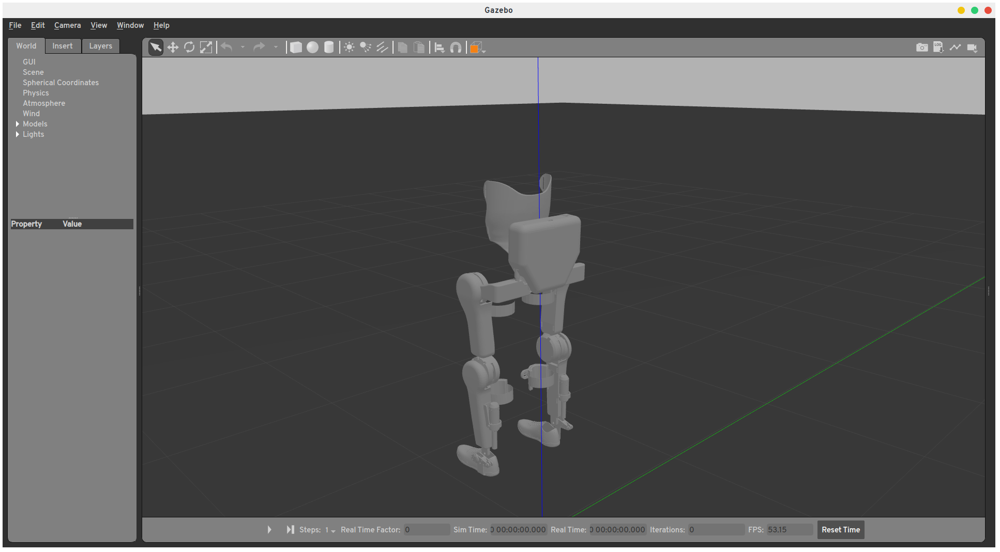

.. _gazebo-label:

Gazebo
======
`Gazebo <https://gazebosim.org/>`_ is a robot simulator that is capable of simulating worlds, robots and complex physics.
Gazebo can integrate with ros using the packages in `gazebo_ros_pkgs <https://wiki.ros.org/gazebo_ros_pkgs>`_.

The simulation packages and plugins for the |march| are contained in the :simulation:`project-march/simulation <>`
repository.

   Gazebo sim GUI
