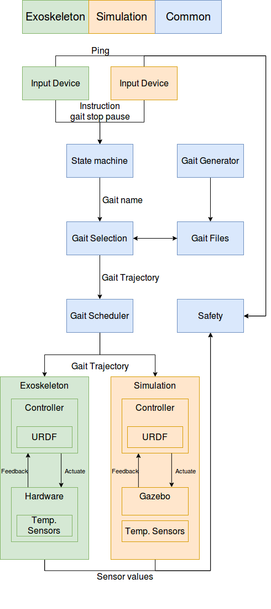

High level overview
===================
.. inclusion-introduction-start

A high level overview of the components that make up the |march|.

.. inclusion-introduction-end

   The March software stack

Simulation versus Exoskeleton
^^^^^^^^^^^^^^^^^^^^^^^^^^^^^
As our exoskeleton is under construction most of the time, we have made use of
a simulation to ensure we can verify our higher level nodes work. As seen in
the above image, most of the hardware components have a simulated counterpart.

When launching, the user can choose whether to launch the simulation or the
hardware. See :ref:`march-launch-label` for more information on launching the
exoskeleton.

Input Device
^^^^^^^^^^^^
