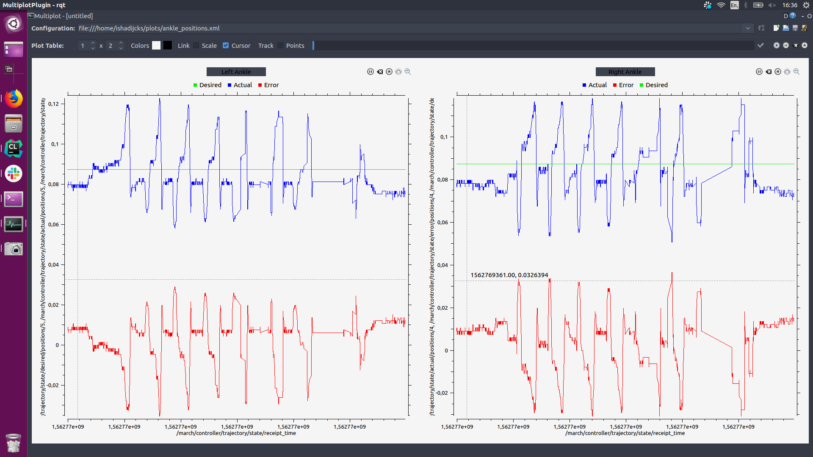

.. _how-to-view-live-data-label:

How to view live data
=====================

Introduction
^^^^^^^^^^^^
This tutorial will teach you how to use the `rqt_multiplot <http://wiki.ros.org/rqt_multiplot>`_ tool to visualize ros data during run-time

rqt_multiplot
^^^^^^^^^^^^^
`rqt_multiplot <http://wiki.ros.org/rqt_multiplot>`_ is an advanced version of `rqt_plot <http://wiki.ros.org/rqt_plot>`_
which allows the user to easily create many plots with different topics.

Please see the documentation linked above as it covers everything you need to know to use it.

   Example rqt_multiplot configuration

Installation
^^^^^^^^^^^^

Install with

.. code::

  sudo apt-get install ros-melodic-rqt-multiplot

Launch with

.. code::

  rqt_multiplot

Configuration
^^^^^^^^^^^^^
rqt_multiplot allows you to save a configuration that determines which plots are displayed in the ui.
You can save and load configurations in the top right of the application.

The :monitor:`monitor <multiplot_configurations>` repository contains a lot of these configurations, which you can load when you are in the rqt_multiplot GUI.
