.. _mujoco_simulation-label:

mujoco_simulation
=================

Overview
--------
what

ROS API
-------

Nodes
^^^^^
*mujoco_reader* - Responsible for doing the thing.

Subscribed Topics
^^^^^^^^^^^^^^^^^

*/mujoco_sensor_output* (mujoco_interfaces/MujocoDataSensing)

Published Topics
^^^^^^^^^^^^^^^^

*/joint_states* (sensor_msgs/JointState)

*/upper_imu* (sensor_msgs/Imu)

*/lower_imu* (sensor_msgs/Imu)

*/lower_imu/position* (geometry_msgs/PointStamped)

*/lower_imu/velocity* (geometry_msgs/Vector3Stamped)

Parameters
^^^^^^^^^^
*/march/template/counter* (*int*, required)
How many to count
*/march/template/countings* (*int[]*, default: [])
List of countings

Tutorials
---------

How to do something
^^^^^^^^^^^^^^^^^^^ 
explain how to do something, for example:

Create a new publisher
^^^^^^^^^^^^^^^^^^^^^^
Create a new publisher in the ``__init__`` of ``InputDeviceController``:

.. code::

from std_msgs.msg import Bool # Import the Bool msg if needed.

self.this_tutorial_works_pub = rospy.Publisher('/march/this/tutorial/works', Bool, queue_size=10)