.. _mujoco_sim-label:

mujoco_sim
=================

Overview
--------
The main node 

ROS API
-------

Nodes
^^^^^
*mujoco_sim* - Responsible for doing the thing.

Subscribed Topics
^^^^^^^^^^^^^^^^^
*/mujoco_input* (template_msgs/TemplateCommand)

*/mujoco_gains* (mujoco_interfaces/MujocoGains)

Published Topics
^^^^^^^^^^^^^^^^
*/mujoco_sensor_output* (mujoco_interfaces/MujocoDataSensing)

Parameters
^^^^^^^^^^
*mujoco_sim.launch.py* Launches the *mujoco_sim*, *mujoco_writer*, and *mujoco_reader* nodes.

*model_to_load* (*string*, default: "model_to_load.xml")
What model to load into MuJoCo

*aie_force* (*bool*, default: False)
Toggles the passive AIE force, defined in *aie_passive_force.py*